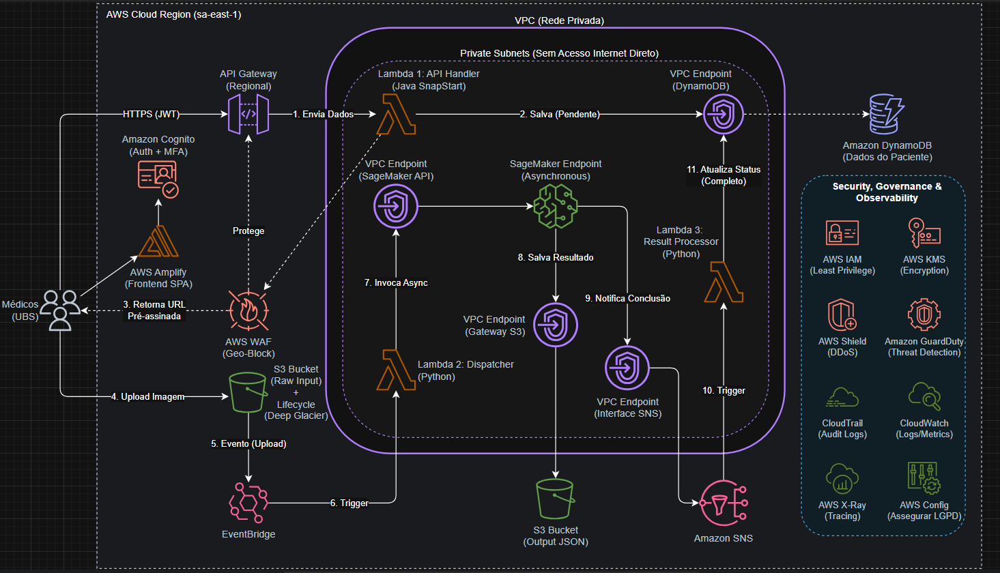

# 🐺 OncoVision AI - The Diagnostic Contract 🎗️

> *"O mal é o mal, Stregobor. Menor, maior, médio, é tudo a mesma coisa... Mas combater o atraso no diagnóstico? Isso é um mal que eu faço questão de erradicar."*

**OncoVision AI** é uma solução **Serverless** e **Orientada a Eventos**, forjada para acelerar a triagem de câncer de mama nas Unidades Básicas de Saúde (UBS).



---

## 📜 O Contrato (Sobre o Projeto)

O **OncoVision AI** foi desenvolvido para caçar um monstro silencioso: o gargalo no diagnóstico de câncer de mama em regiões remotas. Utilizando a infraestrutura da **AWS** como nossos Sinais de Bruxo e técnicas de **Inteligência Artificial** como nossos elixires, o sistema permite que médicos generalistas enviem exames de mamografia e recebam uma "segunda opinião" automatizada em segundos.

Isso não é mágica, é **Engenharia**.

> ⚠️ **Nota do Bardo:** Este repositório contém o **MVP (Minimum Viable Product)** do sistema. Devido aos altos custos de manter uma infraestrutura completa de IA e Big Data em produção, implementamos aqui uma versão com funcionalidades essenciais para fins didáticos e de demonstração.
>
> 📜 **A Lenda Completa:** O projeto integral, com todas as especificações técnicas, arquitetura detalhada e planos de expansão, pode ser encontrado no arquivo **[ProjetoFinal.pdf](./ProjetoFinal.pdf)**.

---

## ⚔️ O Arsenal do Bruxo (Stack Tecnológica)

Para esta caçada, selecionamos as melhores ferramentas do Continente:

*   **Lâmina de Aço (Backend):** Java 21 (AWS Lambda) + Spring Boot (Lógica de Negócios robusta).
*   **Lâmina de Prata (IA):** Python 3.11 + TensorFlow/Scikit-Learn (Para monstros complexos, rodando em Container Docker no AWS ECR).
*   **Grimório (IaC):** Terraform (Para conjurar a infraestrutura).
*   **Bestiário (Banco de Dados):** Amazon DynamoDB (Serverless NoSQL).
*   **Alforje (Armazenamento):** Amazon S3 (Data Lake com Criptografia KMS).
*   **Portal (API):** Amazon API Gateway (HTTP API v2).

---

## 🧪 Preparação (Pré-requisitos)

Antes de trilhar o Caminho, certifique-se de ter os seguintes mutagênicos e ferramentas instalados:

*   **Java JDK 21:** [Download](https://www.oracle.com/java/technologies/downloads/)
*   **Gradle:** (Opcional se usar o wrapper `gradlew` incluso)
*   **Docker Desktop:** [Download](https://www.docker.com/products/docker-desktop/) (O daemon deve estar rodando)
*   **AWS CLI v2:** [Instalação](https://aws.amazon.com/cli/)
*   **Terraform:** [Download](https://www.terraform.io/downloads)
*   **Conta AWS Ativa:** Com permissões de Administrador para criar recursos.

---

## ⚡ A Trilha (Guia de Execução Rápida)

Siga estes passos para levantar toda a infraestrutura em menos de 10 minutos.

### Passo 0: Meditação (Configuração Inicial)
Certifique-se de que suas credenciais AWS estão configuradas e prontas para o combate:

```bash
aws configure
# Informe sua Access Key, Secret Key e Região (recomendado: us-east-1)
```

### Passo 1: Forjando a Lâmina (Compilar o Backend Java)
O Terraform precisa do arquivo `.zip` da função Lambda Java. Vamos gerá-lo.

Navegue até a pasta do backend:
```bash
cd oncovision-mvp/backend-java
```

Execute o build do Gradle:
*   **Windows:** `gradlew.bat buildZip`
*   **Linux/Mac:** `./gradlew buildZip`

*Verifique: O arquivo `backend-java.zip` deve aparecer em `build/distributions/`.*

### Passo 2: Preparando o Recipiente (Criar Repositório ECR)
Como a Lambda de IA depende de uma imagem Docker, precisamos criar o repositório onde ela será guardada antes de tentar criar a Lambda.

Navegue até a pasta do Terraform:
```bash
cd ../terraform
```

Inicialize e aplique parcialmente:
```bash
terraform init
terraform apply -target=aws_ecr_repository.ai_repo -auto-approve
```

⚠️ **Importante:** Copie a URL do repositório que aparecerá no output `ecr_repository_url` (ex: `123456789.dkr.ecr.us-east-1.amazonaws.com/oncovision-mvp-ai-repo`).

### Passo 3: Preparando o Elixir (Construir e Enviar Imagem Docker)
Agora vamos empacotar o código Python e enviar para a nuvem.

Navegue até a pasta do container:
```bash
cd ../ai-container
```

Faça login no Docker da AWS (Substitua `<URL_DO_ECR>` pela URL copiada no Passo 2):
```bash
aws ecr get-login-password --region us-east-1 | docker login --username AWS --password-stdin <URL_DO_ECR>
```

Construa a imagem (compatível com Lambda x86_64):
```bash
docker build --platform linux/amd64 --provenance=false -t oncovision-ai .
```

Tagueie a imagem:
```bash
docker tag oncovision-ai:latest <URL_DO_ECR>:latest
```

Envie para o ECR:
```bash
docker push <URL_DO_ECR>:latest
```

### Passo 4: Conjurando o Mundo (Provisionar Infraestrutura Final)
Agora que o ZIP Java e a Imagem Docker existem, o Terraform pode criar tudo.

Volte para a pasta do Terraform:
```bash
cd ../terraform
```

Aplique a configuração completa:
```bash
terraform apply -auto-approve
```

✅ **Sucesso!** Ao final, o Terraform exibirá a `api_endpoint` (URL da sua API). **Copie essa URL.**

---

## 🖥️ Consultando o Oráculo (Frontend)

Para testar o fluxo completo como um usuário final:

1.  Abra o arquivo `index.html` (na raiz do projeto) em um editor de texto.
2.  Localize a linha: `const API_URL = "SUA_URL_DO_API_GATEWAY_AQUI";`
3.  Substitua pelo valor de `api_endpoint` que você copiou do Terraform (sem a barra `/` no final).
4.  Salve e abra o `index.html` no seu navegador.

**Fluxo de Teste:**
1.  Preencha os dados do paciente.
2.  Clique em **"1. Cadastrar Paciente"**.
3.  Observe o status "PENDENTE".
4.  Selecione uma imagem JPG e clique em **"2. Enviar Imagem"**.
5.  Aguarde alguns segundos e veja o resultado da análise de IA na tela.

---

## 🧹 Queimando os Rastros (Limpeza)

Ao finalizar a demonstração, destrua os recursos para evitar que os cobradores de impostos (AWS Billing) venham atrás de você.

No terminal, dentro da pasta `terraform`:
```bash
terraform destroy -auto-approve
```
*Isso removerá as Lambdas, API Gateway, DynamoDB e Buckets. O ECR também será limpo.*

---

## 🗺️ Mapa do Continente (Estrutura do Projeto)

```
oncovision-mvp/
├── ai-container/       # Código Python da Lambda de IA (Docker)
│   ├── app.py          # Lógica de inferência simulada
│   └── Dockerfile      # Definição da imagem
├── backend-java/       # Código Java da Lambda de API
│   ├── src/            # Handler, DTOs e Lógica S3/Dynamo
│   └── build.gradle    # Script de build
├── terraform/          # Infraestrutura como Código (IaC)
│   ├── main.tf         # Definição dos recursos AWS
│   └── variables.tf    # Configurações
└── index.html          # Frontend SPA para demonstração
```

---

<div align="center">
  <i>Desenvolvido por <b>Weriton L. Petreca</b> e Grupo 2 - Módulo de Extensão em IA.</i><br>
  <i>"Boa sorte no Caminho."</i> 🐺
</div>
